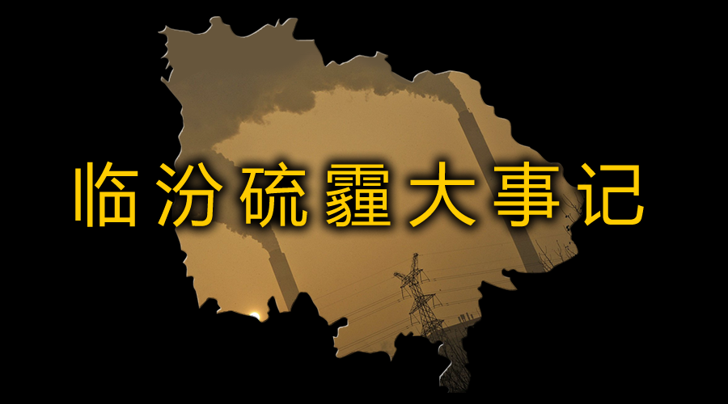

#临汾硫霾大事记

## 2017 年之前

2016年入冬以来，临汾市雾霾频发，二氧化硫浓度在部分时段、部分区域严重超标。国家环保部监测数据表明，2016年临汾市区二氧化硫年平均浓度83μg/m3，超过国家标准(60μg/m3)0.38倍，其中2016年12月为348μg/m3，超标4.8倍。

- 2016-06-22 赵亮 环境亮评：[临汾调查：九成焦化任性排放挡不住？](http://mp.weixin.qq.com/s?__biz=MzA5NDM1NDEyNA==&mid=2650639729&idx=1&sn=ec5b8b23c553e6b3ea7a2252b1415029)
- 2016-11，进入采暖季以来，临汾市雾霾频发，二氧化硫浓度也呈逐渐上升趋势，在部分时段、部分区域严重超标；也是在11月，临汾的6个环境空气自动监测点上交国家进行维护和管理。
- 2016-12-19，临汾日平均浓度达到该年峰值737μg/m3（日平均国家二级标准限值为150μg/m3），超标3.91倍。在这一个月里临汾六个国控监测点的1小时平均浓度累计有130余次突破1000微克/立方米（1小时平均国家二级标准限值为500μg/m3），而整个临汾市的1小时平均值有14次破千。当日山西省大气污染防治工作领导办公室给临汾市政府发布了应对重污染天气7号调度令，要求其采取有效措施解决二氧化硫超标的问题
- 2016-12-28  中国环境报，[环保部、最高法、最高检有关负责人解读《最高人民法院 最高人民检察院关于办理环境污染刑事案件适用法律若干问题的解释》](http://www.cecrpa.org.cn/zcfg/qwjd/9442.htm)
- 2016-12-30，晚9点，二氧化硫浓度高达1010微克每立方米，
- 2016-12-31，晚10点，二氧化硫浓度高达1061微克每立方米；

## 2017 临汾硫霾大事记

## 2017/1/2

- 2017-01-02，晚8点，二氧化硫浓度高达982微克每立方米；

## 2017/1/3

- 2017-01-03，晚9点，二氧化硫浓度高达1115微克每立方米；

## 2017/1/4

- 2017-01-04 09:19:53 @中国气象爱好者 微博发表：[被忽视的霾王：山西临汾爆表三合一](http://weibo.com/ttarticle/p/show?id=2309404060487796054497)。当晚， 氧化硫浓度最高为1331微克每立方米；
- 2017-01-04 临汾防保局称：[出动执法人员725人次，检查工业企业192家，建筑工地4家，其他9家。对发现的7个问题，依法依规予以处理。](http://www.lfxww.com/linfen/fzsh/2556486.html?jdfwkey=n2x4j)
- 2017-01-04 根据真气网数据，临汾SO2小时浓度6次破千，最高时达到1331μg/m3，而当天SO2日平均浓度高达814μg/m3，是2015年以来全国所有城市中日均值最高的一次。（注：指数破千意味着浓度达到毫克级，有可能引起中毒。1000微克等于1毫克）
- 2017-01-04 晚山西省大气办发现监测数据异常后电话联系了临汾市政府。市、县两级执法人员针对一些污染情况进行了突击检查，共出动执法人员725人次，检查工业企业192家，建筑工地4家，其他9家。对发现的7个问题，依法依规予以处理。（临汾新闻网讯 ）

## 2017/1/5

- 2017-01-05 09:19:53 大脸撑在小胸 发表：[昨天，临汾的空气怎么了？](http://weibo.com/ttarticle/p/show?id=2309404060487796054497)
- 2017-01-05 资深媒体人@王志安指出“[接到举报后一晚上二氧化硫数值忽然降低七八倍，临汾如果不是给整个城市安装了新风系统，大概率是数据造假。”](http://weibo.com/1670421223/Epow08fAJ?from=page_1005051670421223_profile)
- 2017-01-05 夜里，师太给环保局打电话，问他们三个问题：第一是哪些地方在偷排？第二是你们对此实行了哪些措施？第三是SO2这么高的数值，你们有没有向公众发预警？
- 2017-01-05，中午，资深媒体人@王志安指出“接到举报后一晚上二氧化硫数值忽然降低七八倍，临汾如果不是给整个城市安装了新风系统，大概率是数据造假。”
- 2017-01-05，晚10点，二氧化硫浓度达911微克每立方米。
- 2017-01-05，00:02，新浪综合，[环境学博士：对雾霾的恐惧与愤怒应化为改革与行动的动力](http://finance.sina.com.cn/china/gncj/2017-01-06/doc-ifxzkfuh5575575.shtml)

## 2017/1/6

- 2017-01-06 上午10点多，临汾环保局给师太打过去电话，语气特别好，把情况又问了一遍，说去请示领导，“之后给您回复”。然后就没影了。当天晚上，我看到临汾的SO2浓度又飙到910μg/m3 。
- 2017-01-06 上午10:14 ，梨视频发布视频：《霾王！二氧化硫爆表，临汾怎么了？》，这是媒体首次报道该事件。
- 2017-01-06, 下午，临汾市政府召开应对重污染天气专题会议，临汾市委副书记、市长刘予强主持会议并讲话。要坚决打击“顶风作案”的违法行为，曝光一批负面典型，对履行环保职责不力、失职渎职的部门和个人进行严厉问责。
- 下午，临汾市政府召开应对重污染天气专题会议，临汾市委副书记、市长刘予强主持会议并讲话。会议要求要坚决打击“顶风作案”的违法行为，曝光一批负面典型，对履行环保职责不力、失职渎职的部门和个人进行严厉问责。（来源：临汾日报）
- 《北京青年报》发表记者屈畅的报道：《临汾二氧化硫“爆表”  环保局称正在调查》：“临汾市环保局多名工作人员向北青报记者表示，他们已经了解到了相关的情况，正在展开调查核实。临汾市环保局办公室的一位工作人员表示，有关领导已经看到了网上的文章，环保局将尽快给公众一个合理的解释。”
- 6日晚上，环境保护部举行媒体座谈会，部长陈吉宁在回应新京报记者有关临汾出现了二氧化硫和PM2.5同时爆表，二氧化硫浓度过千。对于这样的城市出现这样的高浓度污染，是不是应该采取一种更特殊的应急手段的问题时表示：“这是我们非常关注的问题，也在具体研究这两个地区（石家庄和临汾）的问题。”

## 2017/1/7

- 2017-01-07，澎湃新闻联系到临汾市环保局目前主持实际工作的副局长张文清，张文清表示，事情还在调查中，目前因为不清楚会对人体健康造成什么影响，还需要咨询专家的看法。而在 12月19日，山西省大气污染防治工作领导组办公室向临汾市人民政府发布应对重污染天气7号调度令，要求“立即采取有效措施降低空气中二氧化硫浓度，保障公众健康”。
- 腾讯发布专访李汀的视频：《听我说| 气象学博主举报临汾二氧化硫指标爆表，当地环保部门不回应》。
- 7日晚《央视新闻》发表评论认为“直到今天，临汾政府相关部门网站都没有做出正面回应，而且也没有任何关于雾霾SO2含量严重性的警示。不管出于何种原因，面对重污染天气，不及时回应公众关切，部分干部的不担当与不作为，难免会引来吐槽与批评。”

## 2017/1/8

- 00:13 李汀发布了第二篇文章继续关注该事件：《临汾，在污染源数据中消失的城市——临汾高浓度SO2事件进展(1)》，她在文中呼吁：发生了这么严重的污染事件，当地政府至少应该：（1.）公布污染的源解析结果，明确公示偷排企业，和政府采取的措施。（2.）承诺今后把SO2超标也纳入到重污染预警的范围中，警示市民防护。
- 2017-01-08， “临汾同城会” 在微博呼吁:一、启动生态环境损害责任追究办法、终身责任制，严查环保相关部门是否存在失职渎职、贪污受贿。二、建立民众监控举报环保污染的政府渠道。三、逐步在各学校安装空气净化器。四、向民众普及环保污染常识。五、公布临汾地区污染源解析。六、严格要求各高污染企业达到国家相关环保标准。请临汾乡亲们行动起来！权益是争取来的！为了临汾的未来与生命！
- 环保组织空气侠赵亮在其微信公号发表《临汾SO2发飙的三大命门》，认为临汾污染严重的原因有三大问题：第一，燃煤工业独大的产业布局并未根本改变；第二，以罚代管的环境监管模式遭遇挑战，第三，企业违法成本低，环保设施运行未成常态。针对此空气侠提出三个建议，并决定自2017年1月10日起，对山西临汾开展为期一年的拉网式污染源第三方排查。
- 17:38:45 《南方周末》发表《临汾现罕见“酸雾”，健康影响仍待分析》的报道。该文提到：1月8日，临汾市环保局办公室主任张烨告诉南方周末记者，临汾市委市政府自5日开始讨论如何回应公众质疑：“主要是涉及市民健康这一部分，请了北京专家来做分析，对人的危害回复起来很敏感。其他内容我们都准备比较充分了。”记者并采访了李汀，就“酸性雾霾具急毒性”和“SO2超标应纳入重污染预警”进行了重点报道。
- - 18:17 澎湃新闻发表记者王文秋的文章：《重现“伦敦毒雾”？山西临汾就质疑讨论两天“仍无结论”》，对2016年11月以来二氧化硫浓度数据变化进行了梳理。

## 2017/1/9

- 2017-01-09 上午，临汾市环保局副局长张文清在针对二氧化硫超标问题回应称： “经初步排查，临汾市二氧化硫指数超标主要有3方面原因：一是居民燃用散煤，占到了市区燃煤二氧化硫总排量的70%以上。二是工业燃煤排放。三是临汾市处于汾河盆地的平川七县市占全市总面积的32%，集中了全市70%的煤、焦、铁、电力等重污染工业。因为市区‘两川加一河’的地理地貌，在静稳天气等不利气象条件时，污染物不易扩散，增加了市区二氧化硫排放量。”
- 下午，临汾市政府召开了重污染天气应对和大气污染防治座谈会，通报有关情况，研究该市雾霾成因，特别是二氧化硫在部分时段出现严重超标问题的原因。当晚临汾电视台《临汾新闻》对此进行了报道。
- 2017-01-09 22:00 临汾市工商学校监测点二氧化硫浓度测得值再度破千，高达1014微克每立方米。
- 晚上，央视《新闻1＋1》：《雾霾信息公开，如何更透亮？》20170109，对临汾二氧化硫超标问题及政府回应的情况进行了报道和点评。
- 2017-01-09 20:43 今法世界：[雾霾预警下的浮山县鸿丰达铸业公司在污染](http://51zjyo.net/html/shehuijujiao/2017/0109/1473.html)
- 22:00 临汾市工商学校监测点二氧化硫浓度测得值在1月4日之后再度破千，高达1014微克每立方米。

## 2017/1/10

- 1月10日凌晨两点半，《新京报》刊出于平的时评《临汾二氧化硫爆表，居民取暖惹的祸？》。
- 2017-01-10，上午，受临汾市特邀为当地进行大气污染防治源解析工作的中国首席大气科学家、中国环境科学院副院长柴发合向澎湃新闻表示，临汾市提出的二氧化硫爆表原因中民间散煤排放量占7成，是当地自己计算出来的，并不是他做出的结论。
- 上午09:26:47临汾市新闻网发出名为《临汾市政府座谈会共谋应对重污染天气措施》的文章，称临汾市政府在1月9日下午召开重了污染天气应对和大气污染防治工作座谈会。会议上，闫建国同时还表示，对临汾近期持续重污染天气给广大市民生活带来的影响和不便深表歉意，对各位媒体朋友和社会各界的关切、批评诚恳接受。
- 1月10日，《中国青年报》刊出冰点时评《直面公众质疑方显治霾担当》。
- 2017-01-10，下午，临汾市环保局在其官方网站上发表文章，称临汾市政府在1月9日下午召开重了污染天气应对和大气污染防治工作座谈会。会议上，闫建国同时还表示，对临汾近期持续重污染天气给广大市民生活带来的影响和不便深表歉意，对各位媒体朋友和社会各界的关切、批评诚恳接受。
- 1月10日22点，看看新闻网播出的《子午线》栏目其中一节专门谈该事件，题为《临汾二氧化硫“破表”背后的沉默》，该节目梳理了这次环境危机的来龙去脉，并专访了李汀，连线了新京报评论员于平进行评论。

## 2017/1/10

- 《人民日报》1月11日刊出评论文章《“慢半拍”要变“快一步”》。
- 澎湃 第六声 SixthTone 王一苇 关于该事件的英文报道：[Residents Skeptical as City Blames TheirCooking for Toxic Air](http://www.sixthtone.com/news/linfen-city-air-pollution-controversy) ，[中文翻译](http://mp.weixin.qq.com/s?__biz=MzA5NTg4NjA3MQ==&mid=2652515183&idx=1&sn=1c779f872908e0299e4097d83a501121)

## 2017/1/12

- 2017-01-12，[环境保护部与山西省政府联合派出专家组赶赴当地，帮助地方开展污染成因分析，科学制定应对措施。据了解，多位大气环境领域的科学家组成专家组正在当地组织开展污染来源解析，以做好科学处置方案。](http://www.mep.gov.cn/gkml/hbb/qt/201701/t20170112_394684.htm)
- 2017-01-12 15:30 环保部官方微博发布消息说：环境保护部与山西省政府联合派出专家组赶赴临汾，帮助当地开展污染成因分析，科学制定应对措施。据了解，多位大气环境领域的科学家组成专家组正在当地组织开展污染来源解析，以做好科学处置方案。柴发合任组长，共9名专家。
- 2017-01-12，晚间，山西临汾大气二氧化硫浓度自1月4日23时首度破千后，在十天内第三次破千。

## 2017/1/13

- 临汾召开座谈会，拒绝澎湃新闻，会议结束后，张文清被等待记者追问时反问： “ 全国哪个城市有关于二氧化硫的专门预警？你找给我看看 ” 。
- 根据临汾大气办《应对重污染天气调度令》（【2017】第1号）有关要求，实行机动车辆单双号限行临时交通管制。
- 08:14 财新网发出报道《环保部专家组赴临汾分析二氧化硫超标成因》
- 2017-01-13 时评客 绿色和平行动派：[“临汾二氧化硫破千”复盘，谁是罪魁祸首？](http://mp.weixin.qq.com/s?src=3&timestamp=1485792217&ver=1&signature=WwAWVOdVMH3a2xxLY8-HH-*p2g1MCRTyKPYTHNw*qLVTrK0iwzt6Gvs5On-1Lcp1EUwWP7aSy0IyfG7o40L8N6vbgQr6zbCp0bUPC6f-xhF-ZSN2IVxpP0jJCDe6HiWaqmPtr1JsFiRm2D0cTOYyDphoapQi3CuOACQukJo-SfA=)
- 好空气保卫侠：[这些死磕雾霾的人，我支持](http://mp.weixin.qq.com/s?__biz=MzAwODM0NjcwMA==&mid=2731997431&idx=1&sn=eff3d0b1bcbd97aedba3f0f606ce343e)
- 好空气保卫侠：[【霾战】临汾SO2发飙三大命门](http://mp.weixin.qq.com/s?__biz=MzAwODM0NjcwMA==&mid=2731997437&idx=2&sn=a511e90325fee4a2fa34552f83a00e38)
- 中国新闻网：[山西临汾SO2居高 环保专家深夜调研污染成因](http://www.chinanews.com/gn/2017/01-13/8123508.shtml)

## 2017/1/14

- 大脸撑在小胸 发布 [神秘的70%——临汾高浓度SO2事件续2](http://weibo.com/ttarticle/p/show?id=2309404063776071659597)
- 危险地图 发布 [临汾SO2破千事件之历史数据解读--第一回](http://mp.weixin.qq.com/s?__biz=MzI2MTA1NTAwNA==&mid=2651532824&idx=1&sn=0d4cc7ed349b2a0be5d6a2426970b384)
- 新京报：[临汾二氧化硫多次破千 专家调研：环境监管存在问题](http://www.bjnews.com.cn/news/2017/01/14/430644.html)
- 《南方周末》发表记者谭畅有关该事件的第二篇报道：《环保专家赴临汾应对酸雾》文章就三个问题进行了报道：临汾的“硫忙霾”今年为何特别严重？二氧化硫的来源到底是什么？洁净焦为何没有起到预期效果？ 该文首次报道了“硫忙霾”这一临汾市民发明的新词。
- 临汾新闻网：[上午召开的大气污染成因分析反馈会上，环保部与省政府联合专家组就我市大气污染成因及下一步治理措施形成了科学精准意见建议](http://www.lfxww.com/linfen/shizheng/2557222.html)

## 2017/1/15

- 临汾新闻网：[治理大气污染十三条办法出台。](http://www.lfxww.com/linfen/shizheng/2557222.html)
- 南方周末：[环保专家赴临汾应对酸雾 三年来首现“硫忙霾”](http://www.infzm.com/content/122382)
- 网易：[聚焦临汾二氧化硫爆表](https://c.m.163.com/news/s/S1484460127505.html)
- 新京报 16:11:26 ：[山西环保厅公布临汾二氧化硫污染调查结果 86台燃煤锅炉无脱硫措施](http://www.bjnews.com.cn/news/2017/01/15/430698.html)

## 2017/1/16

- 环保部公布了山西省临汾市山西三维瑞德焦化有限公司、山西焦化集团有限公司在线监测大气污染物日均值超标问题。
- 2017-01-16 07:15 FT 中文网：[雾霾与中国人觉醒的“公民性”](http://m.ftchinese.com/story/001070990?from=groupmessage)
- 2017-01-16 03:31:18 新京报：[临汾二氧化硫问题突出](http://www.bjnews.com.cn/news/2017/01/16/430782.html)
- 2017-01-16 15:35 财新：[2017以来二氧化硫四度破千 临汾工厂街头实拍](http://photos.caixin.com/2017-01-16/101044450.html)
- 2017-01-16 14:43 山西青年报：[临汾市委书记岳普煜：再戴重污染帽子 无法向人民交代](http://www.toutiao.com/i6376089357371048449/)
- 2017-01-16 好空气保卫侠：[【观察】柴静老家才是最大的污染源](http://mp.weixin.qq.com/s?__biz=MzAwODM0NjcwMA==&mid=2731997443&idx=2&sn=89c595bc823298e5ee4428ddedec8587)
- 2017-01-16 16:45 澎湃新闻：[污染袭城｜想找到临汾二氧化硫浓度的历史数据，有多难？](http://www.thepaper.cn/newsDetail_forward_1601613)
- 2017-01-16 半岛网：[临汾二氧化硫屡破千: 一供暖公司被批, 整改方案概算825万](http://s4.uczzd.cn/webapp/webview/article/news.html?app=uc-iflow&aid=17507318151674641866)

## 2017/1/17

- 政府上门挨家挨户收散煤了，能停产的工业企业也关停了，但1月17日临汾的SO2日均值仍高达459微克/立方米，部分站点小时均值再出现破千。临汾尧都区环保局一位负责人对跟随环保部督查组前来的新华社记者说：“我们现在也想知道到底是哪的问题。”（据南周报道）
- 2017-01-17 天津绿领： [“SO2事件”| 跳出临汾 放眼山西](http://mp.weixin.qq.com/s?__biz=MzIzNTc1Mjk4MA==&mid=2247483652&idx=1&sn=dc684499686f2749dcffe20f96201e80)
- 2017-01-17 蔚蓝临汾：[临汾老乡，手把手帮你选口罩](http://mp.weixin.qq.com/s?__biz=MzA5NTg4NjA3MQ==&mid=2652515137&idx=1&sn=1b1c67809e08127e8bf188f0e105e9f1)
- 2017-01-17 09:13:15 临汾新闻网：[临汾市控硫治污攻坚指挥部对攻坚行动再安排再部署](http://www.lfxww.com/linfen/shizheng/2557439.html)
- 2017-01-17 09:22 澎湃新闻（转发中国青年报）：[中青报刊文批临汾空气污染：别等上级部门出手才看到“真相”](http://www.thepaper.cn/newsDetail_forward_1602170)
- 2017-01-17 光明日报：[治理空气污染首先要承认问题](http://epaper.gmw.cn/gmrb/html/2017-01/17/nw.D110000gmrb_20170117_4-02.htm)

## 2017/1/18

- 2017-01-18 00:46 澎湃新闻：[气象局停发霾预警？工作人员：正与环保部协商联合发布机制](http://www.thepaper.cn/newsDetail_forward_1603041)
- 2017-01-18 新京报：[临汾SO2破千调查：“顽疾”难除](http://epaper.bjnews.com.cn/html/2017-01/18/content_668510.htm)
- 2017-01-18 04:36:06 李戈戈 新京报新媒体：[3D：临汾二氧化硫屡破千 这呼吸起来啥感觉？](http://www.bjnews.com.cn/video/2017/01/18/431055.html)
- 2017-01-18 08:43:11 [临汾市政府环保紧急会议：全力以赴打赢蓝天保卫战](http://www.lfxww.com/linfen/shizheng/2557590.html)
- 2017-01-18 临汾日报社主办 临汾新闻网：[紧急！临汾市政府对全市排污企业实施停产、限产！](http://mp.weixin.qq.com/s?__biz=MjM5NzQwNTA1Mg==&mid=2649038444&idx=1&sn=8aec56a5456c5b91edce4f7b7e5be5d2)
- 2017-01-18 环境保护：[环保部通报京津冀及周边地区14日开始重污染天气督查情况 再次发现临汾多家企业排污严重超标](http://mp.weixin.qq.com/s?__biz=MzA4MzQ0MjYyMg==&mid=2652201482&idx=1&sn=53636b80524f3b088c9bfef8e9dbcf4d)
- 2017-01-18 赵亮 环境亮评：[【临汾调查】硫忙旋涡 多家企业裸奔](http://mp.weixin.qq.com/s?__biz=MzA5NDM1NDEyNA==&mid=2650640240&idx=1&sn=56c9cce7c7b5ecd674edef9722ae82f1)
- 2017-01-18 新华视点：[临汾二氧化硫污染为何屡“破千”？环保部督查组紧急夜查](http://mp.weixin.qq.com/s?__biz=MzA3NzMyMjUxMw==&mid=2652800071&idx=1&sn=5081037c14edfcabde3e06b61c78a99a)
- 2017-01-18 21:14:45 临汾新闻网：[临汾经济开发区大打控硫治污攻坚战 千名干部齐聚治雾霾](http://www.lfxww.com/kuaixun/2557699.html)

## 2017/1/19

- 2017-01-19 10:51 中国新闻网：[环保部约谈临汾主要负责人：重污染应急响应不力](http://www.chinanews.com/gn/2017/01-19/8129176.shtml)
- 2017-01-19 12:17:40 ·孙瑞丽 新京报新媒体：[临汾二氧化硫浓度骤降 环保局副局长：开展了治污行动攻坚战](http://www.bjnews.com.cn/news/2017/01/19/431197.html)
- 2017-01-19 14:44 空气侠：[临汾被约谈，这些企业“功不可没”](http://www.pearvideo.com/video_1026801)
- 2017-01-19 17:16 CCTV：[环保部约谈山西临汾市政府负责人：督促严格落实环境保护主体责任](http://m.news.cctv.com/2017/01/19/ARTIuhvtWljCVNR71X0pFWGI170119.shtml)
- 2017-01-19 19:27:22 新华社：[这一次，环保部为何“单约”临汾](http://news.xinhuanet.com/politics/2017-01/19/c_1120347278.htm)
- 2017-01-19 21:14 澎湃新闻：[临汾二氧化硫一夜骤降至正常水平，“赶紧让娃出来换换气”](http://www.thepaper.cn/newsDetail_forward_1604464)
- 2017-01-19 21:14 澎湃新闻：[临汾市长被环保部约谈，称自责内疚给环保部添乱、给山西抹黑](http://www.thepaper.cn/newsDetail_forward_1604137)
- 2017-01-19 北美小象君：（赵亮故事）[因为不忍，他在雾霾的源头守卫孩子们的蓝天](http://mp.weixin.qq.com/s?__biz=MzAxMjc5MDMzNg==&mid=2649130944&idx=1&sn=8797ab1ab6e5ed0cab3eb0839fa0f96a)
- 2017-01-19 南方周末：[临汾之外，多少“酸雾”在潜伏](http://mp.weixin.qq.com/s?__biz=Njk5MTE1&mid=2652392982&idx=1&sn=ea40168dc8f96e94b6cf97867539f7f2)
- 2017-01-19 李汀 大脸撑在小胸上：[临汾市长被环保部约谈——临汾高浓度SO2事件续3](http://mp.weixin.qq.com/s?__biz=MzAwMDE4MjcxNQ==&mid=2649843486&idx=1&sn=c240e29c9c2ae76514860091ea8c2233)
- 2017-01-19 丹样年华 真气网：[临汾SO2问题，说到底，还是我们使用煤炭的打开方式不对！](http://mp.weixin.qq.com/s?__biz=MzAxNDM2MDE2OA==&mid=2652229046&idx=1&sn=6f7a6e5fcbe241c208705f8f245b6fe4)
- 2017-01-19 烧砖工 为子孙改善环境：[临汾试点成功证明，中国雾霾毒不死人](http://mp.weixin.qq.com/s?__biz=MzIzMDE0MTE1NQ==&mid=2648633037&idx=1&sn=c5e449f61275a6655e667a8c57b5f6e2)

## 2017/1/20

- 2017-01-20 赵亮 环境亮评：[【观察】突围，临汾走向何方？](http://mp.weixin.qq.com/s?__biz=MzA5NDM1NDEyNA==&mid=2650640246&idx=1&sn=26f7254f178467df4640592c1aff1535)
- 2017-01-20 09:28:37 临汾新闻网：[市政府常务（扩大）会议传达环保部要求](http://www.lfxww.com/linfen/shizheng/2557857.html)

## 2017/1/21

- 2017-01-22 15:31 澎湃新闻：[环保部督查后，临汾对5家排污企业开出2000万元高额罚单](http://www.thepaper.cn/newsDetail_forward_1605919)

## 2017/1/22

- 2017-01-22 [道路交通环境污染严查不手软——临汾公安交警支队环境安全监察大队查获4起违反环境保护法等相关法规的交通违法行为](http://mp.weixin.qq.com/s?__biz=MjM5NDE3MDg1NQ==&mid=2652252080&idx=1&sn=30bc53182bd7cec180323884441f961b)
- 2017-01-22 14:24 光明网-时评频道：[临汾市长被约谈，过山车般的空气数据仅是巧合？ ](http://guancha.gmw.cn/2017-01/22/content_23545399.htm)
- 2017-01-22 09:21 王一苇 中外对话：[临汾二氧化硫爆表原因惹争议](http://3g.163.com/touch/article.html?docid=CBCNN6BC00964LG6)

## 2017/1/23

- 2017-01-23 09:01:02 临汾新闻网：[临汾政府成立3个专项小组分赴控硫治污一线督查](http://www.lfxww.com/linfen/shizheng/2558081.html)

## 2017/1/24

- 2017-01-24 09:54:49  临汾新闻网：[闫建国：全力以赴推动空气质量持续改善](http://www.lfxww.com/linfen/shizheng/2558174.html)
- 2017-01-24 09:29:32  临汾新闻网：[刘予强主持召开控硫治污专题会 部署下一步防治工作](http://www.lfxww.com/linfen/shizheng/2558157.html)

## 2017/1/25

- 2017-01-25 临汾日报社主办 临汾新闻网：[【民生】他的来访将加快“气化临汾”步伐！根本性改善大气质量](http://mp.weixin.qq.com/s?__biz=MjM5NzQwNTA1Mg==&mid=2649038744&idx=4&sn=47bd877092d347d0cc0726c5eea049cd)

## 2017/1/26

- 2017-01-26， 09:27:00，  临汾新闻网： [刘予强慰问临汾开发区尧都区抗霾一线干部职工](http://www.lfxww.com/linfen/shizheng/2558395.html)
- 2017-01-26， 09:28:33，  临汾新闻网：[临汾市政府召开大气污染防治工作会议 刘予强主持并讲话](http://www.lfxww.com/linfen/shizheng/2558377.html)
- 2017-01-26， 09:30:04， 临汾新闻网：[闫建国在襄汾调研控硫工作时要求：科学施策 确保实现超低排放](http://www.lfxww.com/linfen/shizheng/2558378.html)
- 2017-01-26，空气侠，好空气保卫侠：[重磅调查：临汾二氧化硫事件始末 ](http://mp.weixin.qq.com/s?__biz=MzAwODM0NjcwMA==&mid=2731997462&idx=1&sn=49e11624d29fda412d325e9926f126ca)

## 2017/02/04

- 2017-02-04，板凳，蔚蓝临汾 [雾霾并不是他人的困境 ](http://mp.weixin.qq.com/s?__biz=MzA5NTg4NjA3MQ==&mid=2652515204&idx=1&sn=71e138fc809a29b747b3fc8bb3d3f77d)
- 2017-02-04，14:16，刘玉林 郑静 邱睿/临汾新闻网，[山西省将再现重污染天气，临汾市预警措施执行上限标准](http://www.thepaper.cn/newsDetail_forward_1611544)

## 2017/02/06

- 2017-02-06，临汾随手拍 [曝光台 | 襄汾赵四线上几大焦化厂、化工厂、钢厂排污严重](http://mp.weixin.qq.com/s?__biz=MzI3MzU2Nzc2Mg==&mid=2247484265&idx=5&sn=371ac35f17515944104f836be1f10f1f)

## 2017/02/07

- 2017-02-07，临汾新闻网，[力度巨大！临汾对主城区85个燃煤锅炉彻底改造](http://mp.weixin.qq.com/s?__biz=MjM5NzQwNTA1Mg==&mid=2649039095&idx=1&sn=1d102af6ab205c17f6baaa2d4c38482b)

## 2017/02/08

- 2017-02-08，临汾新闻网，[临汾居民燃气锅炉小时代霸气来临：3年内每年补助800元支援你](http://mp.weixin.qq.com/s?__biz=MjM5NzQwNTA1Mg==&mid=2649039172&idx=1&sn=2cba020ca32f7526fc5799b76c79b580)

## 2017/02/10

- 2017-02-10，经济网中国经济周刊，[记者回乡记 | "霾都" 临汾：雾霾也是一种小城市病](http://chuansong.me/n/1556549347334)

## 2017/01/19

- 2017-01-19，19:27:22，新华社，[这一次，环保部为何“单约”临汾](http://news.xinhuanet.com/politics/2017-01/19/c_1120347278.htm)

## 2017/01/26

- 2017-01-26，好空气保卫侠， [重磅调查：临汾二氧化硫事件始末](http://mp.weixin.qq.com/s?__biz=MzAwODM0NjcwMA==&mid=2731997462&idx=1&sn=49e11624d29fda412d325e9926f126ca)

## 2017/02/11

- 2017-02-11，20:14:15，临汾新闻网，[临汾市发布重污染天气红色预警（一级）](http://www.lfxww.com/gggs/2559834.html)

## 2017/02/13

- 2017-02-13 08:52:11，临汾新闻网，[临汾市大气污染防治行动指挥部关于禁烧秸秆垃圾树叶荒草的紧急通告](http://www.lfxww.com/linfen/shizheng/2559901.html)
- 2017-02-13 20:17，中国新闻网，[山西4市二氧化硫浓度高 超值将采取强化措施](http://www.chinanews.com/gn/2017/02-13/8148652.shtml)

## 2017/02/14

- 2017-02-14 09:07:37，临汾新闻网，[环保部将对临汾市展开第一季度空气质量专项督查](http://www.lfxww.com/linfen/fzsh/2560116.html)

## 2017/02/15

- 2017-02-15，新京报，王硕，[环保部长带队督查18城空气质量](http://epaper.bjnews.com.cn/html/2017-02/15/content_671321.htm?div=0)

## 2017/02/17

- 2017-02-17，中国环境报，王昆婷，[环保部通报京津冀及周边地区重污染天气督查情况 再次发现临汾多家企业排污严重超标](http://www.mep.gov.cn/xxgk/hjyw/201701/t20170118_394939.shtml)

## 2017/02/19

- 2017-01-19，中国环境报，王昆婷，[环保部约谈临汾市政府主要负责同志 暂停新增大气污染物排放项目环评审批；临汾市市长表示诚恳接受约谈](http://www.mep.gov.cn/xxgk/hjyw/201701/t20170120_395027.shtml)

## 2017/03/30

- 2017-03-30 10:12 ，中国青年报，胡志中，[山西临汾的两顶帽子：污染大户、环保模范城](http://www.thepaper.cn/newsDetail_forward_1650989_1)

