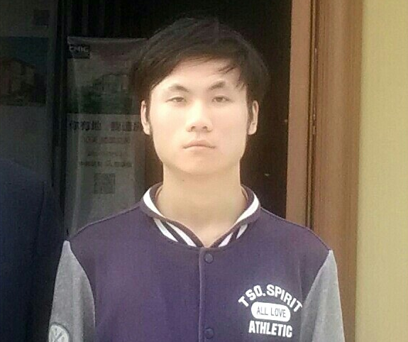
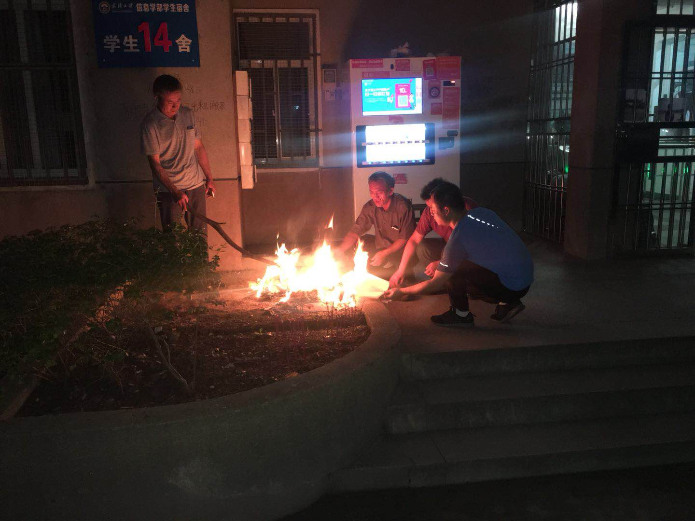
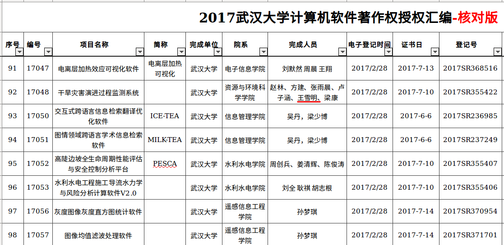
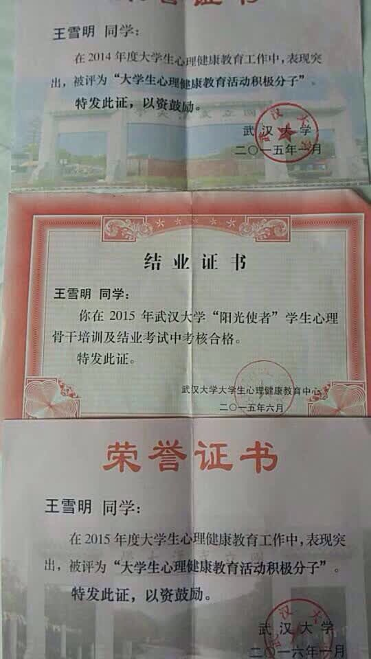
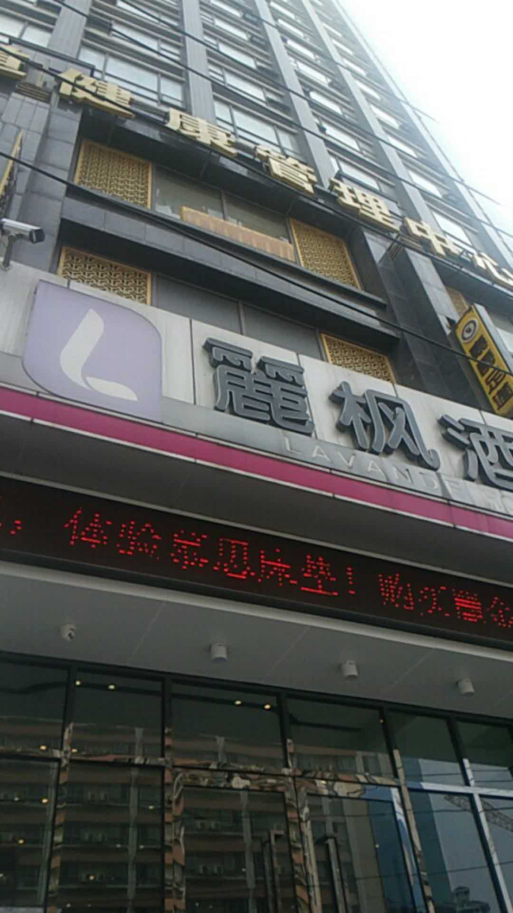
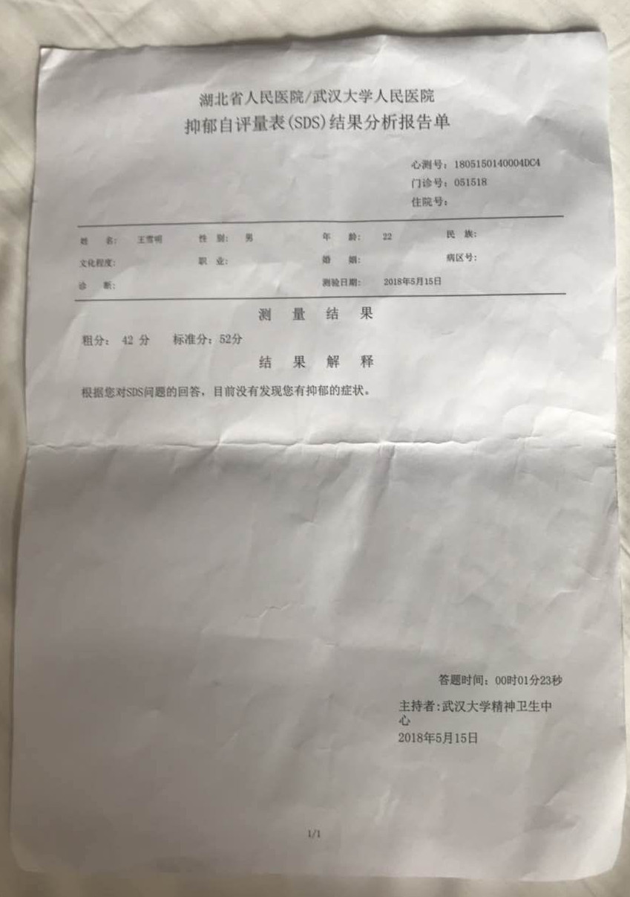
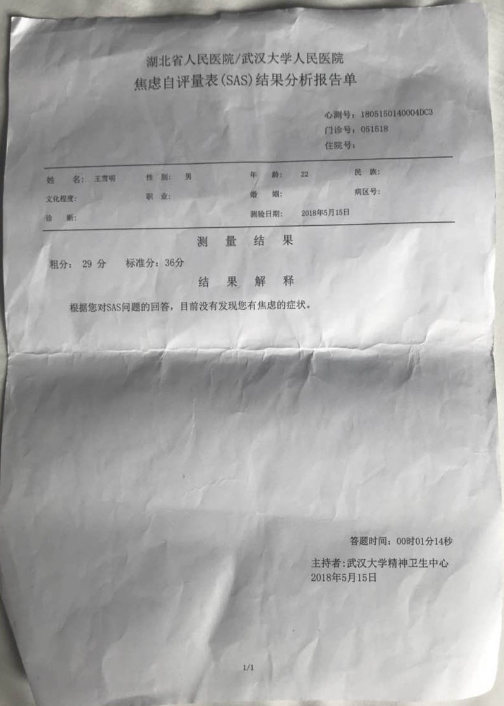

# 2018/06/05 武汉大学王雪明坠楼事件综述

更新时间：2018/06/10 23:00

2018年6月，武汉大学资源与环境科学院地理科学（基地班）的王雪明，正做论文答辩期间，因校方干扰产生事端，并最终导致王雪明于6月5日坠楼身亡，本文拟从多个角度记录与描述整个事件过程。

> [TOC]

## 1. 王雪明基本情况

王雪明，1996 年出生于山西省临汾市，2014 年以 628 分的优异的成绩考入武汉大学资源与环境科学院（http://sres.whu.edu.cn/），所学专业为地理科学（基地班），学号：2014301110090 。

王雪明在校期间，参与开发 “干旱灾害演进过程监测系统” ，获国家计算机软件著作权保护（见附图1）。并积极参与校园活动，被评为 “2014年大学生心理健康教育活动积极分子”、2015 年“大学生心理健康教育活动积极分子” ，参加过 2015 年武汉大学“阳光使者” 学生心理骨干培训（见附图2）。

## 2. 遇害人父亲王新民的痛诉

> **一、吾儿雪明坠楼**
>
> 吾儿雪明，1996年生人，2014年考入武汉大学资源与环境学院，于2018年6月5日上午10时24分，从丽枫酒店坠楼而下。
>
> **二、坠楼经过**
>
> 经调取6月5日酒店及交通相关录像显示，其辅导员王某带领校保卫处一行众人于上午10点17分左右来到酒店外，吾儿10点24分从丽枫酒店13楼坠下，其中原委得从一年前吾儿宿舍楼对面一幢楼的一起坠楼事件说起。
>
> **三、事发原因**
>
> 一年前武大校园宿舍楼发生了一起坠楼事件，就在吾儿宿舍楼对面，据校方所说坠楼事件后那两天，有天校安保人员在监控中发现吾儿在事发现场徘徊，之后便被校安保人员询问和列为重点监控对像。其间的吾儿所经历的心理恐惧与挣扎是何其之大，之后又被校方取消了保研资格，对吾儿生理和心理上造成了巨大压力和阴影，一度出现了厌学情绪。后过年回家经父母精心劝导终得云开雾散，过完年开学回校！
>
> 五月初突然接到学校辅导员电话，要求家长到校商谈孩子退学或休学问题，其母迅速赶往学校。孩子辅导员王XX以校医务室出具的一份检查报告为据，说吾儿患中度抑郁症，要求办理休学或退学，其母闻之不信其谈，但又敢怒而不敢言，眼见得若是顺利再过个把月就可毕业参加工作，在这节骨眼上办理休学或退学心有不甘。就和辅导员商谈后被迫与校方鉴下了一份所谓的监护人转移协议，并要求其母带孩子离开学校宿舍不得住校，到武汉第一人民医院精神科做检查！
>
> 次日其母带孩子去做了检查，院方检查结果（见附图4）显示吾儿只不过是有轻微症状，医生说还谈不上得抑郁症。一个武大的高材生被学校逼迫让其母带着自己去看精神科，这是对吾儿及其母的人格侮辱！其母便拿着人民医院的检查报告找该辅导员商议解除协议孩子正常上学住宿之事，该辅导员态度蛮横的指责其母出示院方检查报告作假，而推托此事！
>
> 事后得知是因吾儿不积极配合他做论文答辩所至，后吾儿不服学校的规定回校宿舍写论文以做六月份的答辨，校方默许。
>
> 至五月下旬，该辅导员又要吾儿签就业协定，吾儿不愿签此为校方提高就业率而为的三方协定，该辅导员就以不签就离校相威协而纠缠吾儿。
>
> 事发前两天该辅导员要求吾儿4号去见他，吾儿生性胆小老实，于是就离校住进酒店，以此来躲避该辅导员老师的纠缠。岂知该辅导员学校宿舍寻找无果后，报警称学生失踪，警方查监控得知吾儿住处后告知该辅导员，于是就出现了开头监控记录的那一幕！
>
> 悲哉吾儿！冤乎吾儿？
>
> 该辅导员粗暴野蛮的行事作风一窥可知该为吾儿之死负责。
>
> **四、校方态度**
>
> 作为一所公立大学，不光该有教书的责任，更该有育人的情怀，不光是一个循规蹈矩的组织，更应是一个有肩膀有担当的社会栋梁，然而，我们很遗憾的看到，武汉大学资环院在事情发生后百般推委，万般塞责，对自己学生的枉死不置可否、傲慢颟顸。甚至竟然以之前在其母未明情况之下签过一份所谓协议书为由妄图敷衍推脱，想想令人不屑，令人齿寒。
>
> 想想四年前，一众亲属是怀着何等欣喜倾慕的心情欢天喜地的送吾儿来校，作为父亲所感受到的荣光一生无二，如今在我面前的却只剩一具冰冷的尸体，锥心之痛、天崩地裂啊。
>
> 武大情怀何在，魂梁何存？抑或与吾儿现况一般？

## 3. 事件过程时间线

1. 2015年7月4日，武汉大学发生一起男生跳楼事件（报道：<http://news.163.com/api/15/0704/15/ATMJ12TO00011229.html> ），王雪明的宿舍就在男生所跳楼的对面，王雪明当天因在楼下徘徊，被保安持续两天询问调查，并成为重点监控对象，这对于王雪明可能构成了一定的影响或心理伤害。
2. 2018年5月初，家长 “突然接到学校辅导员电话，要求家长到校商谈孩子退学或休学问题，其母迅速赶往学校。孩子辅导员王XX以校医务室出具的一份检查报告为据，说吾儿患中度抑郁症，要求办理休学或退学。” ，“和辅导员商谈后被迫与校方鉴下了一份所谓的监护人转移协议，并要求其母带孩子离开学校宿舍不得住校，到武汉第一人民医院精神科做检查！”
3. “次日其母带孩子去做了检查，院方检查结果显示吾儿只不过是有轻微症状，医生说还谈不上得抑郁症。”  ，“其母便拿着人民医院的检查报告找该辅导员商议解除协议孩子正常上学住宿之事，该辅导员态度蛮横的指责其母出示院方检查报告作假，而推托此事！”
4. 引用王父： “事后得知是因吾儿不积极配合他做论文答辩所至，后吾儿不服学校的规定回校宿舍写论文以做六月份的答辨，校方默许。” 
5. 引用王父：“至五月下旬，该辅导员又要吾儿签就业协定，吾儿不愿签此为校方提高就业率而为的三方协定，该辅导员就以不签就离校相威协而纠缠吾儿。”
6. 2018年6月3日晚，王雪明住到校园附近武昌珞珈区丽枫酒店（见附图3）十三楼临街房。
7. 2018年6月5日，上午10:17，武汉大学辅导员王某带领校保卫处几个人来到酒店外，10:24:14 王雪明从高空坠落（从窗外跳楼），地面为钢化街道， 当场致命。
8. 2018年6月6日，王雪明家属一行四人到武昌处理善后事宜。
9. 2018年6月9日晚，亲人在学校宿舍门口烧纸惦念孩子。

   

## 4. 家属的疑问

王雪明已去世多日，校方至今没有对这个悲剧做出公开的说明，且整个过程多处存疑，现家属提出以下疑问，期待校方给出合理解释。

1. 2014年，勤奋好学、阳光灿烂的王雪明满怀激情的步入校园，武大四年之后怎么就有了精神病 ？且王雪明还连续多年获武汉大学心理健康优秀者奖状（见附图2）。
2. 王雪明交着住宿费，未做出任何影响同学与学校的行为，为何不让住宿舍？
3. 王雪明住进酒店，遭校方报警搜查，是否涉嫌侵害个人隐私?
4. 是否存在武汉大学为就业率好看，强迫学生违心签署就业协议？
5. 王雪明辅导员王XX曾出具的一份检查报告，说王雪明患中度抑郁症，并要求办理休学或退学。事发后，家属要求确定鉴定报告检查人是否具有相应的资格，校方至今没有提供，是否合理 ？且同期（2018/05/15）有武汉大学精神卫生中心鉴定显示：SDS 显示没有抑郁症状， SAS 显示没有焦虑症状，为何 ？
6. 王雪明在武汉大学上的是基地班，学生历来都是保研的，且王雪明没有挂课项目，取消保研资格是否合理 ？
7. 近几年在武汉大学先后发生如下悲剧，武汉大学是否到了需要反思与检点自己的时候？
   1. 2007/05/18，武汉大学17舍女生跳楼事件：https://blog.csdn.net/lookthesea/article/details/1615545
   2. 2015/07/04，武汉大学发生一起男生跳楼事件，传言因其没有拿到学位证（新闻报道：http://news.163.com/api/15/0704/15/ATMJ12TO00011229.html ） 
   3. 2016/05/27 武大基地班保研率骤降20%，学生不满校方违背招生承诺 <https://www.thepaper.cn/newsDetail_forward_1475229>
   4. 2017/03/20 武大大二学生吴胜失联后，跳江自杀的真实原因在这  http://blog.sina.com.cn/s/blog_4b7a2b720102wvve.html

## 5 遇害人父亲王新民寻求社会帮助

为理清真相，告慰孩子，也还社会一个公道，逝者之父亲王新民特向社会寻求帮助：寻求武汉大学了解情况且有良知的老师、学生能够提供任何相关信息、想法和建议；寻求社会各界尤其新闻媒体、法律工作者、教育工作者能提供任何信息、想法和建议；也寻求任何人通过您的口碑及社交媒体传播对我们的支持。

> 手机：18634571577
>
> QQ邮箱：1343929572@qq.com

逝者之父亲王新民，泣血拜谢！

## 6. 附图

1. 王雪明在校参与软件开发作品，见序号29 “干旱灾害演进过程监测系统”

   
   ​

2. 王雪明在校期间，参与精神健康学习及活动的证书

   

3. 武汉大学校园对面王雪明坠楼的宾馆

   

4. 2018/05/15 武汉大学的鉴定书

   1. SDS抑郁自评量表

   

   2. SAS 焦虑自评量

   
