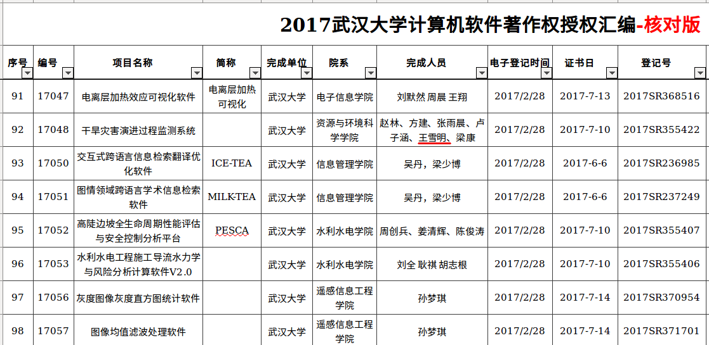

#6/5 武汉大学王雪明坠楼事件综述

更新时间：2018/06/09 23:00

2018年6月，武汉大学资源与环境科学院地理科学（基地班）专业班（资环3班）的王雪明，正在做论文答辩期间，因与校方在学业方面发生冲突，并最终导致王雪明于6月5日坠楼身亡。

本文整理了王雪明坠楼事件背景、过程以及家长对事件处理的诉求，力求中立的记录事件过程。

关键词：武汉大学、基地班、保送研究生、论文答辩、精神鉴定、离校、鉴定就业去向

## 1. 王雪明基本情况

王雪明，1994年出生于山西省临汾市，2014年以624分的优异的成绩考入武汉大学资源与环境科学院（http://sres.whu.edu.cn/），所学专业为地理科学（基地班），学号：2014301110090 。

王雪明在校期间，参与开发 “干旱灾害演进过程监测系统” ，获国家计算机软件著作权保护（见附件1），并积极参与校园活动，被评为 “2014年大学生心理健康教育活动积极分子”、2015年“大学生心理健康教育活动积极分子” ，参加过 2015年武汉大学“阳光使者” 学生心理骨干培训（见附件2）。

## 2. 事件过程

> 2015年7月4日，武汉大学发生一起男生跳楼事件，传言因其没有拿到学位证（新闻报道：http://news.163.com/api/15/0704/15/ATMJ12TO00011229.html ），王雪明的宿舍就在该男生所跳楼的对面，王雪明当天因在楼下徘徊，被保安持续两天询问调查，并成为重点监控对象，此事对王雪明造成了一定的心理阴影。

王雪明在武汉大学上的是基地班，学生历来都是保研的，且王雪明没有挂课项目，满以为会获得保研。但2018年春节王雪明回家后情绪低落、精神恍惚，家人才知道学校取消保研资格，经家人尽力宽慰和疏解后，王雪明的情绪才基本得到安抚。

但是万万没有想到，返校后，被确定有精神病受到监控。且校方处理草率，缺少沟通和指导，未尽到教育释疑的职责，致使王雪明产生抵触情绪，未能积极撰写论文，后来校方竟然做出要求他离校的处理，禁止他继续住在学校宿舍。

后学校通知家属来校，家属来校后积极配合进行诊疗，医院出具证明认为只有轻微症状未构成致病，而校方对湖北省人民医院出具的证明怀疑，指责家属做假。但经协商，仍然默许孩子回宿舍，王雪明也积极配合导师写论文。但是在论文答辩前，再次以未鉴定就业去向为由，让王雪明离开学校宿舍，住进酒店，

> 家属质疑：1. 孩子离开宿舍，没有电脑，无法完成论文答辩；2. 辅导员在答辩之前要求孩子鉴工作协议具心何在？
>

2018年6月3日晚，王雪明住到校外武昌珞珈区丽枫酒店（见附件2）十三楼临街房。

2018年6月5日上午10:17，武汉大学辅导员王某带领校保卫处几个人来到酒店外，上楼后数次敲门，10:24:14 王雪明从高空坠落（从窗外跳楼），地面为钢化街道， 当场致命。

2018年6月6日，王雪明家属一行四人到武昌处理善后事宜。

2018年6月9日晚，亲人在学校宿舍门口烧纸惦念孩子。

## 3. 遇害人父亲王新民的痛诉

> 吾儿雪明，1996年生人，2014年考入武汉大学资源与环境学院，于2018年6月5日上午10时24分，从丽枫酒店坠楼而下。经调取6月5日酒店及交通相关录像显示，其辅导员王某带领校保卫处一行众人于上午10点17分左右来到酒店外，吾儿10点24分从丽枫酒店13楼坠下，其间的吾儿所经历的心理恐惧与挣扎是何其之大，该辅导员一贯以来粗暴野蛮的行事作风一窥可知。作为一所公立大学，不光该有教书的责任，更该有育人的情怀，不光是一个循规蹈矩的组织，更应是一个有肩膀有担当的社会栋梁，然而，我们很遗憾的看到，武汉大学资环院在事情发生后百般推委，万般塞责，对自己学生的枉死不置可否、傲慢颟顸。甚至竟然以之前在其母未明情况之下签过一份所谓责任书为由妄图敷衍推脱，想想令人不屑，令人齿寒。想想四年前，一众亲属是怀着何等欣喜倾慕的心情欢天喜地的送吾儿来校，作为父亲所感受到的荣光一生无二，如今在我面前的却只剩一具冰冷的尸体，锥心之痛、天崩地裂啊。
>
> 武大情怀何在，魂梁何存？抑或与吾儿现况一般？
>
> 当然，或许比吾儿强一点，可以当个行尸走肉。

## 4. 家长疑问

王雪明已去世几日，至今校方没有给出一个合理的解释，受害者家属有如下问题，希望校方给出明确答复。

1. 2014年，勤奋好学、阳光灿烂的王雪明满怀激情的步入校园，武大四年之后怎么就有了精神病呢？且矛盾的是，王雪明连续多年均获武大心理健康优秀者奖状。
2. 王雪明交着住宿费，未做出任何影响同学与学校的行为，为何不让住宿舍？
3. 王雪明住进酒店，遭校方报警搜查，是否涉嫌侵害个人隐私?
4. 是否存在武大为了粉饰学校就业率，逼迫学生违心签协议？从而成为压跨王雪明心理防线的最后一根稻草，悲剧就此发生？
5. 近几年在武汉大学先后发生了如下悲剧，武汉大学是否到了需要反思与检点自己的时候？
   1. 2007/05/18，武汉大学17舍女生跳楼事件：https://blog.csdn.net/lookthesea/article/details/1615545
   2. 2015/07/04，武汉大学发生一起男生跳楼事件，传言因其没有拿到学位证（新闻报道：http://news.163.com/api/15/0704/15/ATMJ12TO00011229.html ） 
   3. 2016/05/27 武大基地班保研率骤降20%，学生不满校方违背招生承诺 https://www.thepaper.cn/newsDetail_forward_1475229
   4. 2017/03/20 武大大二学生吴胜失联后，跳江自杀的真实原因在这  http://blog.sina.com.cn/s/blog_4b7a2b720102wvve.html

## 5. 附件

1. 王雪明在校参与软件开发作品，见序号29 “干旱灾害演进过程监测系统”

   

   ​

2. 王雪明在校期间，参与精神健康学习及活动的证书

3. 武汉大学校园对面王雪明坠楼的宾馆

