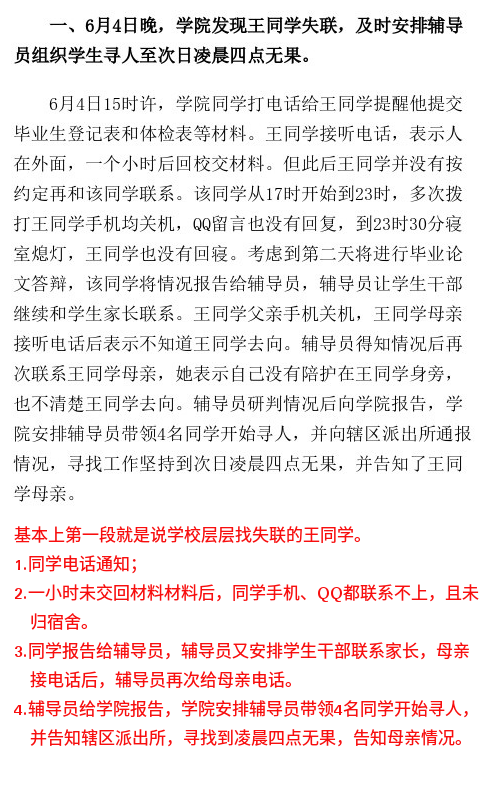
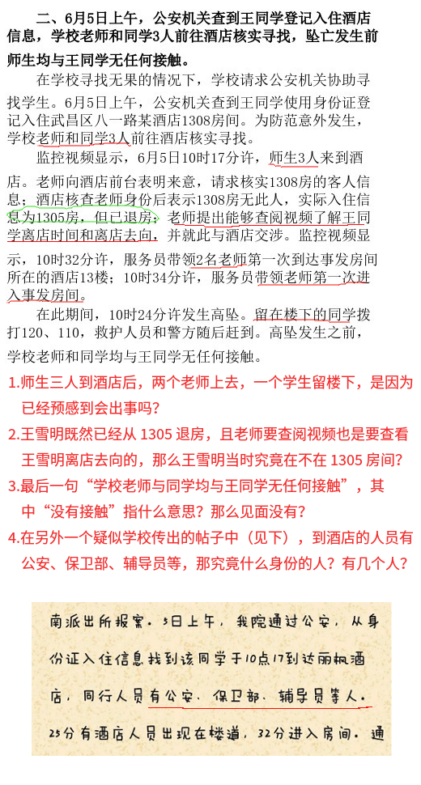
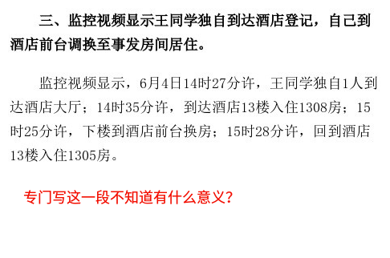
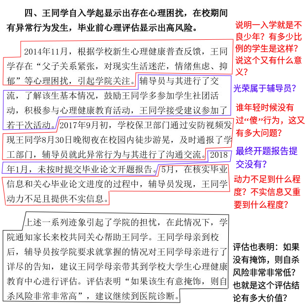
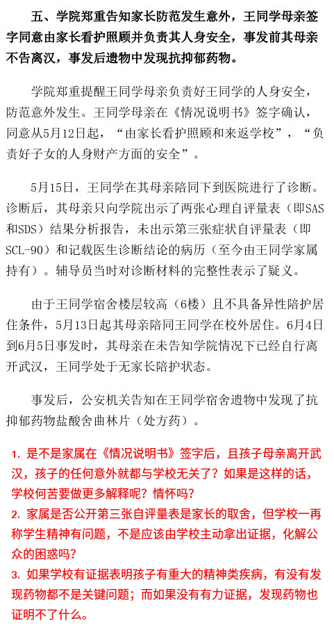

# 对“武汉大学关于高坠情况说明”的一些疑问

与洗地五毛横飞及其胡说八道相比，武大官方说明还是干净整齐很多，不过有些疑问还是想提出来，不妥之处还请各方指教。

说明文第一段是个情况说明，只归结一下，没有疑问。

第六、七段先不写。

**粗略把问题总结如下：**

1. 说明文中，6月4日主要是辅导员处理事情，那6月5日去酒店的有没有辅导员？在疑似武汉大学校内传出的帖子中，说6月5日去酒店的有公安、保卫部的、辅导员等人。那究竟谁去了酒店？
2. 说明文中，6月5日去酒店后，王同学已经退房，那究竟是如何高坠的，是否查明？文中说高坠发生前，学校老师和同学都与王同学没有任何接触，那潜含之意是不是在高坠之前见到过王同学呢？
3. 学校一再描述王同学有精神问题，是有诊断依据呢，还是仅仅根据王同学的表现得出呢？

最后还有一个疑问，说明文最后有一句 “将依法依规处理”，不知道指的是依什么法？依什么规？